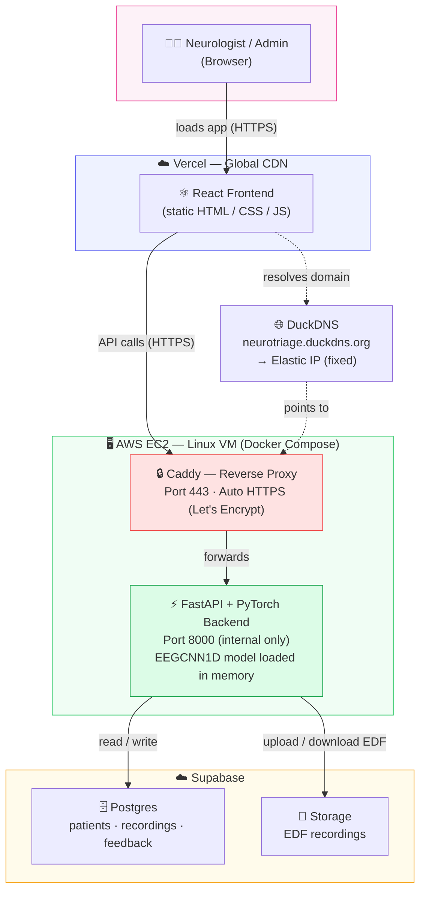
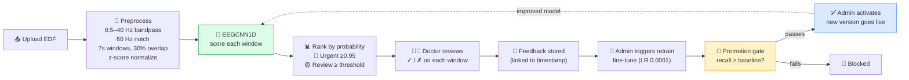

# NeuroTriage — System Architecture

> Render this diagram at [mermaid.live](https://mermaid.live) (paste the code block) or open in VS Code with a Mermaid extension, then screenshot for LinkedIn.

---

## ML Inference & Feedback Loop

